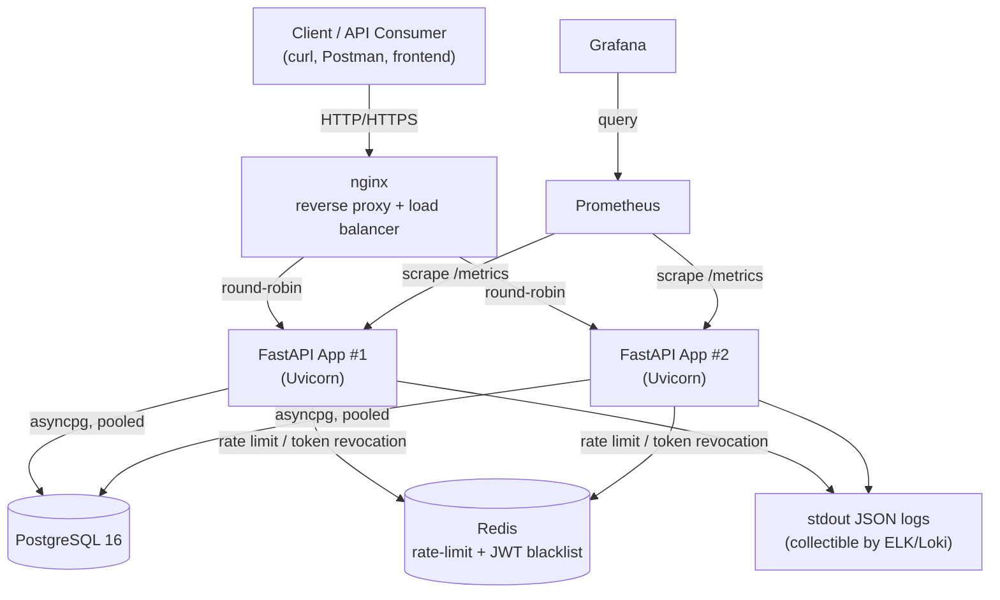
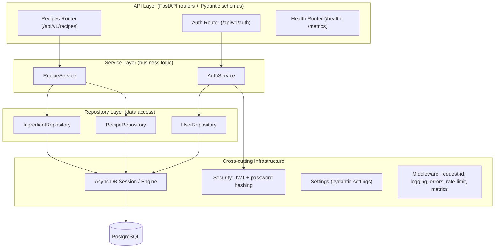
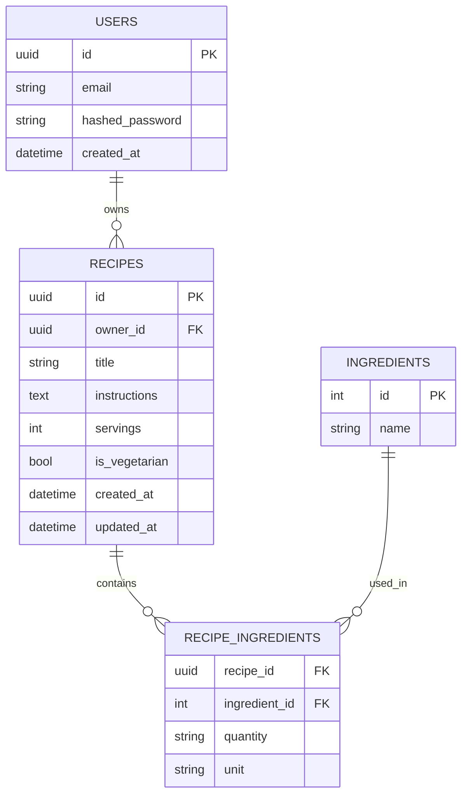
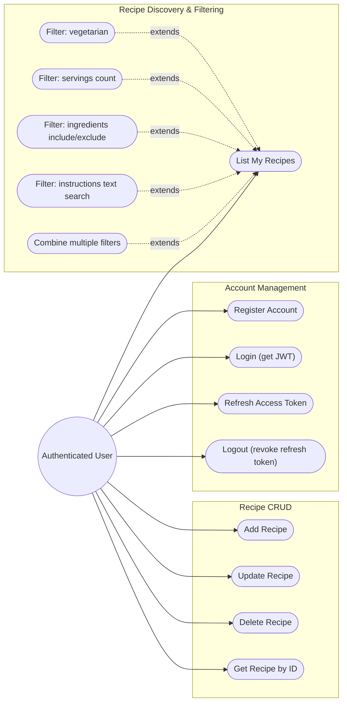
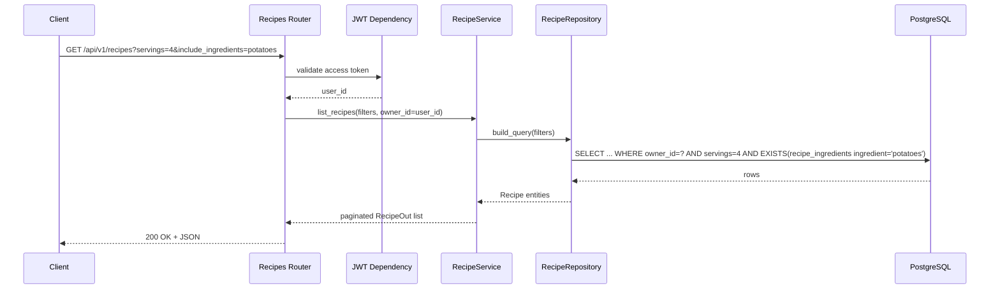
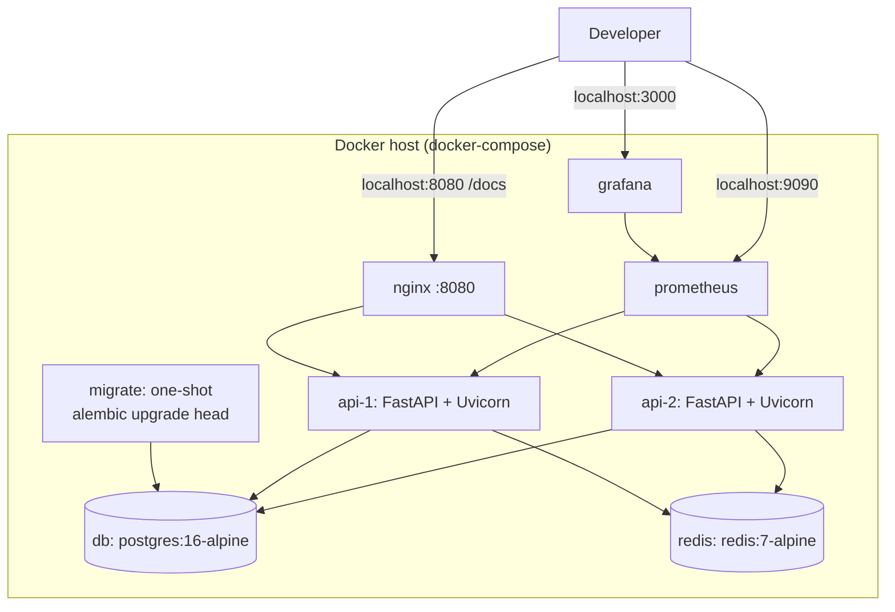

# Recipe Manager — Architecture & Delivery Plan

## Context

We're building a standalone, production-grade Python REST API for managing recipes
(add/update/delete/fetch) with rich filtering (vegetarian, servings, ingredient
include/exclude, instruction text search, and combinations thereof). This is a
**greenfield project** (empty directory, no existing code), so this plan covers the
full architecture before any code is written.

Decisions confirmed with the user:
- **Auth**: JWT-based user accounts (access + refresh tokens). Each authenticated
  user manages their own private collection of recipes ("their favourite recipes").
  *Assumption*: recipes are owned per-user (not a shared global catalog) — flag if
  this is wrong before Phase 3.
- **Database**: see trade-off table below — recommending PostgreSQL.
- **Framework**: deferred to the trade-off discussion below — recommending FastAPI.

---

## 1. Framework Choice (carried over, recommend FastAPI)

| Option | Pros | Cons |
|---|---|---|
| **FastAPI (recommended)** | Native async, automatic OpenAPI/Swagger + ReDoc docs, Pydantic v2 validation, dependency-injection system maps cleanly to layered architecture, excellent perf | Smaller admin/ecosystem vs Django |
| Flask + Flask-RESTX | Mature, simple, huge ecosystem | Async is bolted-on, manual OpenAPI/validation wiring, more boilerplate for production concerns |
| Django REST Framework | Batteries included (admin, ORM, auth) | Heavyweight for this scope, ORM is sync-first, more ceremony |

**Recommendation: FastAPI + Uvicorn (Gunicorn-managed workers in Docker) + SQLAlchemy 2.0 async + Pydantic v2.**

---

## 2. Database Choice — Trade-offs

| Option | Pros | Cons | Verdict |
|---|---|---|---|
| **PostgreSQL (recommended)** | ACID, mature, excellent SQLAlchemy/Alembic support, native full-text search (`tsvector`/GIN) for instruction search, efficient `EXISTS`/`NOT EXISTS` subqueries for ingredient include/exclude, scales via read replicas, first-class Docker image | Requires running a DB service (trivial in docker-compose) | **Best fit** — relational model (users → recipes → ingredients) plus strong query/search support |
| SQLite | Zero config, file-based, instant for local dev/unit tests | Poor concurrent-write handling, not viable for multi-instance prod, weak FTS (needs FTS5 extension) | Good only as a **unit-test** backend, not for prod or integration tests |
| MySQL/MariaDB | Similar relational model, widely deployed | Full-text search weaker than Postgres, JSON support weaker | Viable alternative if org already standardized on it — otherwise no advantage over Postgres |
| MongoDB | Flexible documents, natural fit for nested ingredient lists, `$text` search, `$all`/`$nin` for include/exclude | Weaker relational integrity for users↔recipes ownership, transactions add overhead, different driver/ORM (Motor/Beanie), team needs to learn aggregation pipelines for combined filters | Workable but adds complexity without a clear win given the relational nature of "user owns recipes" |

**Recommendation: PostgreSQL 16** as the system of record (SQLAlchemy 2.0 async + asyncpg + Alembic migrations). SQLite (in-memory) is used only for fast unit tests of repository logic; integration tests run against real Postgres (via docker-compose / testcontainers).

---

## 3. High-Level Architecture (Container View)



`nginx` terminates client connections and load-balances across both FastAPI instances — locally this demonstrates the same topology a production deployment would use (ALB/ingress + replicas), just with `nginx` standing in for the cloud load balancer.

## 4. Layered Application Architecture



## 5. Data Model (ER Diagram)



Indexing strategy:
- GIN index on `recipes.instructions` (`to_tsvector`) for instruction text search.
- Composite index on `recipes (owner_id, is_vegetarian, servings)` for common filters.
- Index on `recipe_ingredients(ingredient_id)` to support include/exclude (`EXISTS`/`NOT EXISTS`) subqueries efficiently.
- Unique constraint on `ingredients.name` (normalized lowercase) to avoid duplicates.

---

## 6. Use Case Diagrams (per feature)



### Example filter combinations from the spec, mapped to query params

| Spec example | Query |
|---|---|
| All vegetarian recipes | `GET /api/v1/recipes?is_vegetarian=true` |
| Serve 4, contains "potatoes" | `GET /api/v1/recipes?servings=4&include_ingredients=potatoes` |
| Without "salmon", "oven" in instructions | `GET /api/v1/recipes?exclude_ingredients=salmon&instructions_contains=oven` |

### Sequence Diagram — combined filter search



---

## 7. REST API Surface

| Method | Path | Description | Auth |
|---|---|---|---|
| POST | `/api/v1/auth/register` | Create user account | No |
| POST | `/api/v1/auth/login` | Obtain access + refresh JWT | No |
| POST | `/api/v1/auth/refresh` | Rotate access token | Refresh token |
| POST | `/api/v1/auth/logout` | Revoke refresh token (Redis blacklist) | Yes |
| POST | `/api/v1/recipes` | Create recipe | Yes |
| GET | `/api/v1/recipes/{id}` | Fetch single recipe | Yes |
| PUT | `/api/v1/recipes/{id}` | Update recipe | Yes |
| DELETE | `/api/v1/recipes/{id}` | Delete recipe | Yes |
| GET | `/api/v1/recipes` | List/filter recipes (query params below) | Yes |
| GET | `/health/live` | Liveness probe | No |
| GET | `/health/ready` | Readiness probe (DB check) | No |
| GET | `/metrics` | Prometheus metrics | No (internal network) |

`GET /api/v1/recipes` query params (all optional, combinable with AND):
`is_vegetarian`, `servings`, `include_ingredients` (repeatable), `exclude_ingredients` (repeatable), `instructions_contains`, `page`, `page_size`.

Full API documented automatically via FastAPI's OpenAPI schema → Swagger UI (`/docs`) and ReDoc (`/redoc`).

---

## 8. Concurrency, Parallelism & Thread Safety

- **Async I/O**: All endpoints async; SQLAlchemy 2.0 async engine + `asyncpg` driver + connection pool → high concurrency for DB-bound requests without blocking the event loop.
- **Multi-core**: Uvicorn run with multiple worker processes (`WEB_CONCURRENCY` env var), each with its own connection pool — scales across CPU cores in a single container, and horizontally via multiple container replicas behind the reverse proxy.
- **Statelessness / thread safety**: No shared mutable in-process state. Per-request dependencies (DB session, current user) injected via FastAPI `Depends`. Any cross-instance shared state (rate-limit counters, revoked-token blacklist) lives in Redis, not in-process memory — avoids race conditions across workers/replicas.
- **Local 2-instance demo**: the docker-compose stack runs two identical `api-1`/`api-2` containers behind `nginx` (see §13). This isn't just for show — it's a live test of the statelessness claim above: if rate limiting or token revocation were ever implemented with in-process memory, requests round-robined between the two instances would behave inconsistently. Running two instances locally catches that class of bug before it reaches production.
- **CPU-bound work** (none required by current spec, but documented for future): would use `run_in_executor` with a `ProcessPoolExecutor`, or an external worker (Celery/RQ + Redis) if heavy async background jobs are needed later — **not included in initial scope** to avoid over-engineering.

### Transaction Management & Atomicity

- **Unit of work**: one `AsyncSession` per HTTP request, injected via dependency. Represents a single DB transaction for that request.
- **Multi-step writes wrapped atomically**:
  - *Create recipe*: insert `recipes` row, upsert each ingredient (`INSERT ... ON CONFLICT (name) DO NOTHING`), insert `recipe_ingredients` rows — all within `async with session.begin():`. Any failure rolls back the whole operation, so no orphaned recipe or partial ingredient list is ever persisted.
  - *Update recipe*: update scalar fields and replace ingredient associations (delete old `recipe_ingredients`, insert new) in the same transaction — avoids a visible intermediate state with zero/duplicate ingredients.
  - *Delete recipe*: `recipe_ingredients.recipe_id` FK uses `ON DELETE CASCADE`, so deleting the recipe row atomically removes associations at the DB level.
- **Concurrent ingredient creation**: the "get-or-create ingredient" race (two requests creating "potatoes" simultaneously) is resolved with Postgres `INSERT ... ON CONFLICT (name) DO NOTHING` — atomic upsert, no app-level locking.
- **Rollback on error**: the session dependency uses `try/except/else` around `yield session` — commits on success, rolls back on any unhandled exception before the error response is returned.
- **Isolation level**: default Postgres READ COMMITTED is sufficient — recipes are scoped per-owner with no cross-record invariants beyond FK integrity, so SERIALIZABLE is unnecessary.

---

## 9. Security

- Password hashing: `passlib[argon2]`.
- JWT access tokens (short-lived, ~15 min) + refresh tokens (~7 days), signed with a secret from env/secrets manager; refresh tokens revocable via Redis blacklist on logout.
- Authorization: every recipe operation checks `recipe.owner_id == current_user.id` (403/404 otherwise).
- Input validation: strict Pydantic v2 schemas (length limits, enums, types) — mitigates injection and malformed-payload issues.
- SQL injection prevented by SQLAlchemy parameterized queries (no raw string interpolation).
- Rate limiting via `slowapi` (Redis backend), tighter limits on `/auth/*`.
- CORS configured via env-driven allow-list.
- Security headers middleware (HSTS, X-Content-Type-Options, X-Frame-Options, etc.) — HSTS only meaningful behind TLS-terminating proxy in prod.
- Secrets via environment variables / `.env` (never committed) — `.env.example` provided.
- Dependency vulnerability scanning (`pip-audit`) wired into CI.

---

## 10. Observability

- **Logging**: `structlog` → structured JSON logs to stdout, including request ID (generated/propagated via middleware), user ID, latency, status code.
- **Metrics**: `prometheus-fastapi-instrumentator` exposes `/metrics` (request rate, latency histograms, in-flight requests, error rates). Local docker-compose includes Prometheus (scrapes the app) + Grafana (pre-provisioned dashboard).
- **Health checks**: `/health/live` (process up) and `/health/ready` (DB connectivity), used by Docker healthchecks/orchestrator probes.

---

## 11. Testing Strategy

- **Unit tests** (`pytest`, `pytest-asyncio`): service-layer business logic with mocked repositories, Pydantic schema validation, security utilities (hashing/JWT), and the recipe-filter query-builder logic in isolation. Fast, run against SQLite in-memory where a DB is needed.
- **Integration tests**: `httpx.AsyncClient` against the real FastAPI app + a real PostgreSQL instance (docker-compose test service or `testcontainers-python`). Covers full auth flow + recipe CRUD + the exact filter combinations from the spec (vegetarian-only, servings=4 + "potatoes", exclude "salmon" + "oven" in instructions).
- **Coverage**: `pytest-cov`, enforced threshold in CI (e.g. ≥80%).
- **Quality gates**: `ruff` (lint+format), `mypy` (type checking), pre-commit hooks.

---

## 12. Project Structure

```
recipe-manager/
├── app/
│   ├── main.py                  # FastAPI app factory, router registration, middleware
│   ├── core/
│   │   ├── config.py            # pydantic-settings, env-driven
│   │   ├── security.py          # JWT, password hashing
│   │   ├── logging.py           # structlog setup
│   │   └── middleware.py        # request-id, error handling, rate limit
│   ├── api/v1/
│   │   ├── deps.py               # current_user, db session deps
│   │   └── routers/
│   │       ├── auth.py
│   │       ├── recipes.py
│   │       └── health.py
│   ├── models/                   # SQLAlchemy ORM: user.py, recipe.py, ingredient.py
│   ├── schemas/                  # Pydantic: user.py, recipe.py, auth.py, common.py
│   ├── repositories/             # user_repository.py, recipe_repository.py
│   ├── services/                 # auth_service.py, recipe_service.py
│   └── db/                       # session.py, base.py
├── alembic/                       # migrations
├── tests/
│   ├── unit/
│   └── integration/
├── docker/
│   ├── Dockerfile                 # multi-stage, non-root user
│   ├── docker-compose.yml         # nginx, api-1, api-2, db, redis, prometheus, grafana
│   ├── nginx/
│   │   └── default.conf           # upstream { api-1, api-2 }, load balancing
│   └── prometheus/
│       └── prometheus.yml         # scrape targets: api-1:8000, api-2:8000
├── docs/
│   ├── architecture.md            # this plan's diagrams, finalized
│   └── adr/                        # architecture decision records
├── .env.example
├── pyproject.toml
├── alembic.ini
└── README.md
```

---

## 13. Docker / Local Deployment



- Multi-stage `Dockerfile`: build stage installs deps (uv/poetry/pip), final slim runtime image runs as non-root user, `HEALTHCHECK` hits `/health/live`. The same image is used for `api-1`, `api-2`, and `migrate` — only the command differs.
- **Two app replicas (`api-1`, `api-2`)**: identical service definitions (same image/env), each on its own internal port. Defined as two explicit services rather than `docker compose up --scale` so `nginx` can reference them by stable hostnames in its `upstream` block — avoids the extra complexity of Docker DNS-based dynamic resolution for a local demo. In a real orchestrator (Kubernetes/ECS/Swarm), this maps to a single Deployment/Service with `replicas: 2` and the platform's built-in service discovery/LB.
- **`nginx`** (`docker/nginx/default.conf`): defines an `upstream` block listing `api-1:8000` and `api-2:8000`, default round-robin load balancing, proxies all paths. Exposed on `localhost:8080` — `/docs`, `/redoc`, and `/api/v1/*` all go through it.
- **`migrate`**: a one-shot service running `alembic upgrade head` to completion, with `api-1`/`api-2` declaring `depends_on: migrate (condition: service_completed_successfully)`. Running migrations from a single dedicated step (rather than from each API container's entrypoint) avoids both instances racing to apply the same migration concurrently.
- **Prometheus** (`docker/prometheus/prometheus.yml`) scrapes `api-1:8000/metrics` and `api-2:8000/metrics` directly (bypassing nginx) so each series carries a distinct `instance` label — Grafana can show both aggregated and per-instance views, useful for visually confirming the load balancing is working.
- `.env.example` documents all configuration (shared by `api-1`/`api-2`/`migrate`).

---

## 14. CI/CD (GitHub Actions)

Pipeline: checkout → install deps → `ruff` lint/format check → `mypy` → unit tests → spin up Postgres+Redis service containers → integration tests → coverage report → build Docker image.

---

## 15. Production Checklist — items beyond the original spec (all included in this plan unless marked stretch)

| Item | Status |
|---|---|
| CI/CD pipeline (lint, type-check, tests, build) | Included |
| DB migrations (Alembic) | Included |
| Reverse proxy + load balancing (nginx, 2 API replicas locally) | Included |
| Structured JSON logging + request correlation IDs | Included |
| Metrics (Prometheus) + dashboards (Grafana) | Included |
| Liveness/readiness health checks | Included |
| Rate limiting | Included |
| API versioning (`/api/v1`) | Included |
| Pagination on list endpoint | Included |
| Centralized error handling + consistent error schema | Included |
| Env-based config + secrets via `.env` | Included |
| Dependency vulnerability scanning (pip-audit) | Included |
| Pre-commit hooks (lint/format/type-check) | Included |
| Auto-generated API docs (Swagger/ReDoc) | Included |
| ADRs / architecture docs | Included |
| Test coverage thresholds | Included |
| Graceful shutdown (SIGTERM handling via Uvicorn) | Included |
| DB connection pooling + startup retry/backoff | Included |
| CORS configuration | Included |
| Security headers | Included |
| Backup/restore strategy doc for prod DB | Documented only (not implemented locally) |
| Load testing (locust) | Stretch / optional |
| Caching layer for hot read queries | Stretch / optional (Redis already present for rate-limit/blacklist, can extend) |
| Async background job processing (Celery) | Not needed for current scope — documented as future extension |

---

## 16. Delivery Mode: Guided Self-Implementation

The user writes the code; the assistant acts as a guide/mentor at each step —
explaining what to build and why, referencing the relevant section of this
document, showing small illustrative snippets where helpful for learning, and
reviewing the user's code once written (correctness, security, adherence to
this plan) before moving to the next step. Tests are written alongside each
feature, not bolted on at the end.

### Step-by-step roadmap

1. **Project scaffolding & tooling** — repo init, directory structure (§12), `pyproject.toml` (FastAPI, SQLAlchemy 2.0 async, asyncpg, alembic, pydantic-settings, structlog, passlib, pyjwt, slowapi, pytest, ruff, mypy), pre-commit config.
2. **App skeleton** — `app/core/config.py` (env-driven settings), `app/core/logging.py` (structlog), minimal `app/main.py` with `/health/live`; run with `uvicorn` to verify.
3. **Database setup** — `app/db/base.py` (async engine/session), SQLAlchemy models (`User`, `Recipe`, `Ingredient`, `RecipeIngredient` per §5 ER diagram with indexes), Alembic init + first migration against local Postgres (`docker run postgres` or compose `db` service).
4. **Repository base + session dependency** — generic session-per-request dependency with commit/rollback (§8 Transaction Management), `UserRepository` skeleton.
5. **Auth — core + unit tests** — `app/core/security.py` (password hashing, JWT encode/decode), Pydantic schemas (`UserCreate`, `UserOut`, `Token`), unit tests for hashing/JWT using SQLite in-memory where needed.
6. **Auth — service + repository** — `AuthService` (register/login/refresh/logout), Redis-backed refresh-token blacklist, unit tests with mocked repository.
7. **Auth — router + integration test** — `/api/v1/auth/*` endpoints, `get_current_user` dependency; integration test against real Postgres (register → login → access protected route → refresh → logout).
8. **Recipe CRUD — schemas + repositories** — `RecipeCreate/Update/Out` schemas, `RecipeRepository` + `IngredientRepository` with atomic create/update (§8 Transaction Management: upsert ingredients, replace associations), unit tests for repository logic.
9. **Recipe CRUD — service + router + integration tests** — `RecipeService` with ownership checks, `/api/v1/recipes` CRUD endpoints, integration tests for create/get/update/delete + 403/404 ownership cases.
10. **Filtering & search** — query-param schema (`is_vegetarian`, `servings`, `include_ingredients`, `exclude_ingredients`, `instructions_contains`, pagination), filter query-builder in `RecipeRepository` (EXISTS/NOT EXISTS for ingredients, `tsvector`/GIN for instructions), integration tests for the **3 spec examples** verbatim.
11. **Observability** — request-ID + structured logging middleware, `prometheus-fastapi-instrumentator` (`/metrics`), `/health/ready` (DB check).
12. **Security hardening** — `slowapi` rate limiting (Redis backend) on `/auth/*`, CORS config, security headers middleware.
13. **Dockerize — single instance** — multi-stage `Dockerfile`, minimal `docker-compose.yml` (`api`, `db`, `redis`), verify `docker compose up` end-to-end.
14. **Dockerize — production topology** — add `migrate` one-shot service, split into `api-1`/`api-2`, add `nginx` (upstream/load balancing, §13), add `prometheus` + `grafana` with scrape config and a basic dashboard.
15. **CI/CD** — GitHub Actions workflow (lint, mypy, unit tests, integration tests w/ Postgres+Redis service containers, coverage gate, Docker build).
16. **Docs & wrap-up** — `README.md` (how to run, architecture summary, API examples), `docs/adr/` entries for key decisions, final review against the Production Checklist (§15).

### Working agreement per step

For each step: the assistant explains the goal, key design points from the architecture doc, and any non-obvious gotchas; the user implements the files; the assistant reviews the diff and they iterate before moving on.

---

## Verification

- `docker compose up` brings up the full stack; `GET http://localhost:8000/docs` shows interactive API docs.
- `pytest tests/unit` passes without external services.
- `pytest tests/integration` passes against the docker-compose Postgres/Redis services.
- Manually exercise the three spec filter examples via `/docs` or `curl` against a seeded dataset.
- `GET /health/ready` returns 200 once DB is reachable; Grafana dashboard at `localhost:3000` shows live request metrics.
